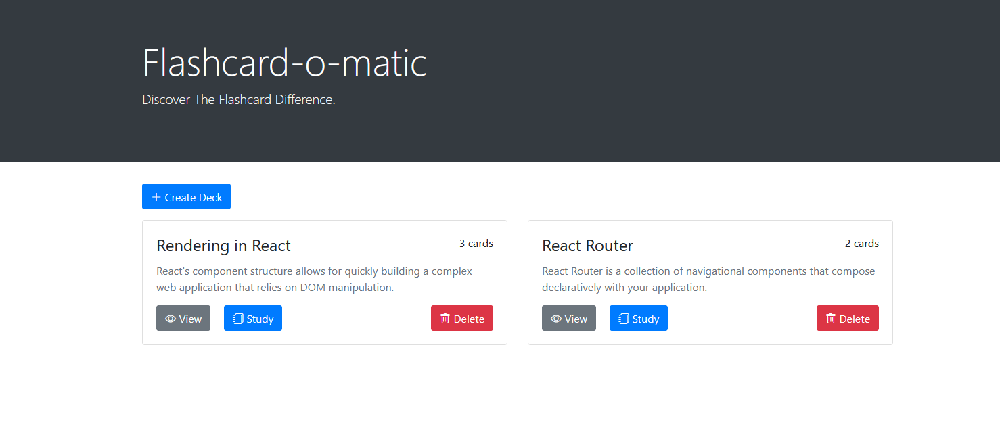
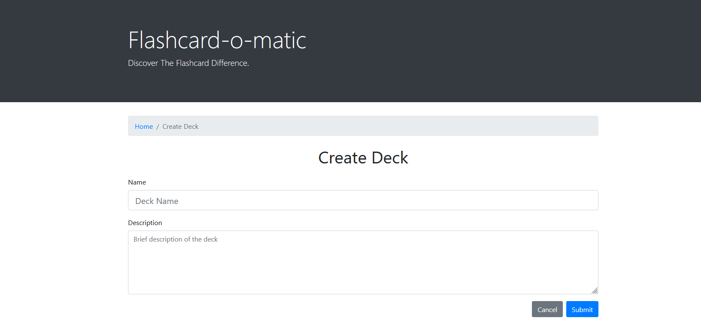
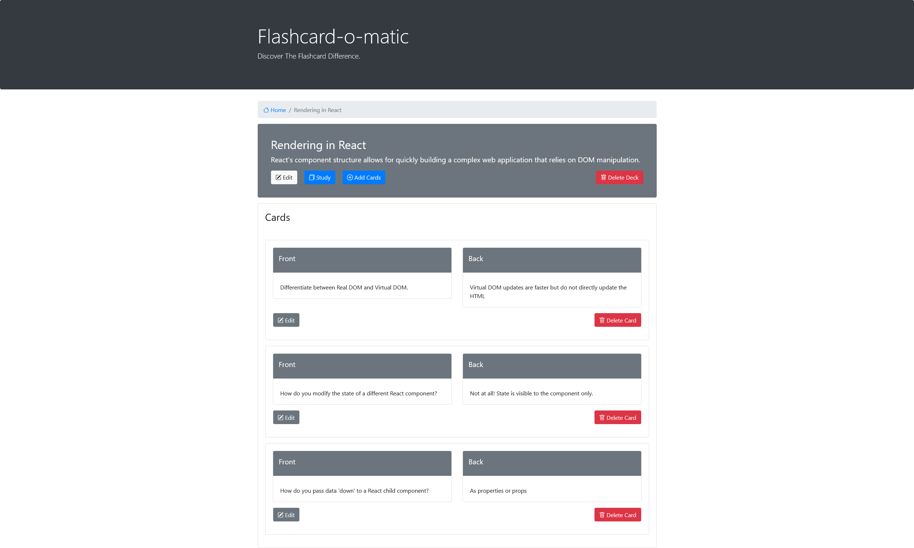
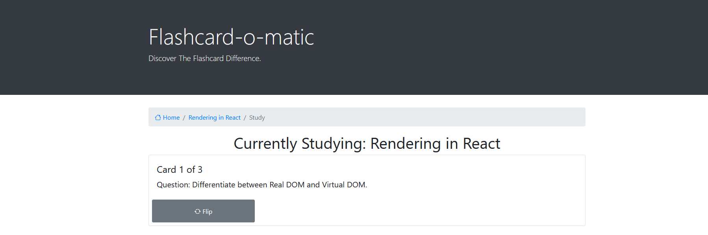

# Flashcard-O-Matic 

This project was bootstrapped with [Create React App](https://github.com/facebook/create-react-app).

## Project description: Flashcard-o-matic

A local school has decided to put together a flash card application, Flashcard-o-matic, to help their students study online. Teachers will use this application to create decks of flash cards for the subjects that they teach, and students will study the decks. The school needs you to build the application that the students and teachers will use.

Built using Bootstrap and React to design the user-interface and implemented react routers and hooks to manage API calls.

### Demo

Open [demo](https://flashcard-o-matic-f9511jgn9-xjinojose.vercel.app/) to view it in your browser.

The demo was deployed using Vercel.

### Express API

Open [flashcard-o-matic API](https://json-server-vercel-alpha-six.vercel.app/) to view it in your browser.

The flashcard-o-matic API was deployed using Vercel.

Note:
To run it locally, change the value of API_BASE_URL in utils/api/index.js to http://localhost:5000 (see below)

const API_BASE_URL = process.env.API_BASE_URL || "https://json-server-vercel-alpha-six.vercel.app";

## Getting Started

### `Home`

- **Create Deck**: prompts the user to enter the deck name and description.
- **Decks**: display the decks.
- **View**: shows the deck information and the cards in that deck.
- **Study**: direct the users to an study session using the deck's flashcards.
- **Delete**: deletes the deck.

### `Create Deck`

### `View Deck`

**Deck**
- **Edit**: prompts the user to change the deck name and/or description.
- **Study**: direct the users to an study session using the deck's flashcards.
- **Add Cards**: add a card to the deck.
- **Delete**: deletes the entire deck.

**Cards**
- **Edit**: Edit the card's front and/or back.
- **Delete**: Deletes the card.

### `Study`

- **Flip**: shows the back of the card.
- **Next**: move to the next card.
- **Previous**: view the previous card.

## Next Steps and Improvements

- Improve UX design for better usability
- Add more features like score system and rewards (gamification).